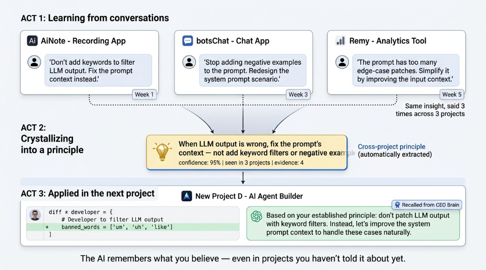
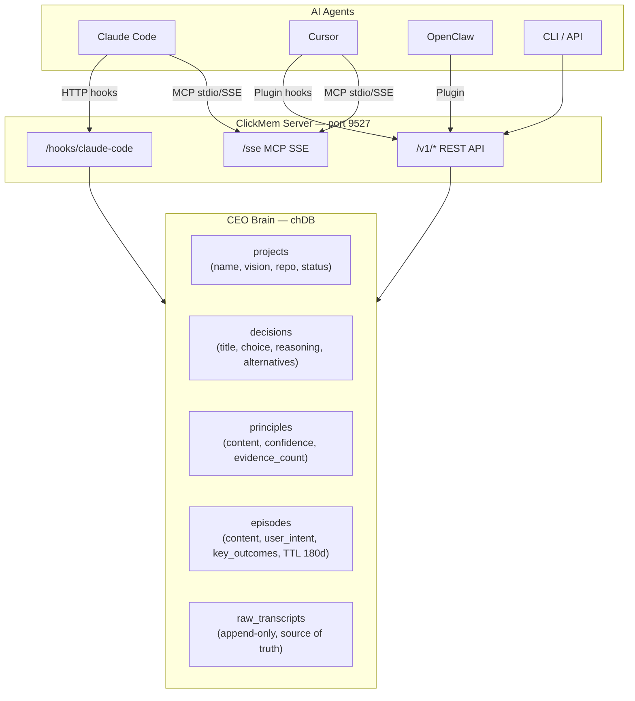

# ClickMem



**CEO Brain for AI coding agents — local-first, persistent, LAN-shareable.**

AI coding assistants forget everything between sessions. ClickMem extracts structured knowledge from your conversations — decisions with reasoning, reusable principles, project context — and injects it back when you start a new session. Your agents inherit your thinking patterns, not just raw facts.

## Quick Start

```bash
pip install clickmem
memory service install        # start background server
memory hooks install          # install hooks for Claude Code, Cursor, OpenClaw
memory import                 # import existing conversation history
```

After this, every Claude Code and Cursor session automatically recalls relevant context on start and captures knowledge on completion.

## Architecture



**One server, all your tools.** A single process serves REST API + MCP SSE on port 9527. Every agent on the LAN shares the same knowledge base.

## How It Works

### Knowledge Extraction

When a conversation ends, ClickMem runs CEO-perspective extraction via a local LLM:

| Entity | What it captures | Lifecycle |
|--------|-----------------|-----------|
| **Decision** | Choice + reasoning + alternatives + context | Permanent; outcome tracked |
| **Principle** | Reusable rule or preference | Permanent; evidence accumulates via dedup |
| **Episode** | What happened + user intent + key outcomes | TTL 180 days; time-decayed |
| **Project** | Name, repo URL, status, vision, tech stack | Auto-created from cwd |

For long conversations (50+ turns), the extractor segments the text into chunks and processes each one. Built-in dedup prevents duplicate principles across segments and sessions — instead, the evidence count increases.

### Context Injection

On `SessionStart`, ClickMem assembles a structured CEO context (~1700 tokens) and injects it:

```
## Principles
- [95%] User correction > AI inference: never overwrite user-modified data
- [90%] Edit source files, not compiled output

## Recent Decisions
- Tag Normalization Strategy: Two-phase extraction with global registry
- Speaker Protection: isUserRenamed flag to protect corrections

## Recent Activity
- Implemented Welcome Sheet onboarding flow for AiNote
```

### Search & Recall

`memory recall` searches both legacy memories and CEO Brain entities via hybrid search:
- Vector similarity (256-dim Qwen3 embeddings)
- Keyword matching on content, tags, entities
- Type-specific scoring (validated decisions boosted, principles weighted by confidence)
- MMR diversity re-ranking

### Local LLM

ClickMem auto-selects a local LLM based on available hardware:

| Hardware | Model | Speed |
|----------|-------|-------|
| Apple Silicon 32GB | Qwen3.5-9B-4bit (MLX) | ~15s/extraction |
| Apple Silicon 16GB | Qwen3.5-4B-4bit (MLX) | ~8s/extraction |
| Apple Silicon 8GB | Qwen3.5-2B-4bit (MLX) | ~4s/extraction |
| NVIDIA GPU | Qwen3.5 (transformers) | varies |
| CPU-only | Remote API fallback | depends on provider |

Override with `CLICKMEM_LOCAL_MODEL`. Thinking mode is disabled (`enable_thinking=False`) for structured JSON output.

## CLI Reference

```bash
# Global
memory help [subcmd]              # Help for any command
memory status                     # Memory stats + CEO entities + import progress
memory discover                   # Detect installed agents and session counts

# Import & Hooks
memory import [--agent all] [--path /dir] [--remote URL] [--foreground]
memory hooks install [--agent all]
memory hooks status

# Memory Operations
memory recall "query"             # Hybrid search (legacy + CEO)
memory remember "fact" --category preference
memory ingest "conversation..." --source cursor
memory forget "memory ID or query"
memory review --layer semantic
memory maintain                   # Cleanup + CEO dedup + episode expiry

# CEO Brain
memory portfolio                  # All projects overview
memory brief [--project-id X]    # Detailed project briefing
memory projects                   # List projects
memory decisions                  # List decisions
memory principles                 # List principles

# Service
memory serve [--host 0.0.0.0]    # Start server (REST + MCP SSE)
memory mcp                        # MCP stdio (for Claude Code / Cursor)
memory service install|start|stop|status|logs
```

## Import Workflow

`memory import` discovers conversation history from all installed agents and ingests it into ClickMem:

```bash
memory discover                    # See what's available
# Agent       Sessions  Docs  Hook
# claude-code      140     0  installed
# cursor             2     0  not installed
# openclaw          26     0  installed

memory import --agent all          # Import all (runs in background)
memory status                      # Check progress
```

**What gets imported:**
- **Transcripts**: Claude Code JSONL (`~/.claude/projects/`), Cursor agent-transcripts (`~/.cursor/projects/`)
- **Knowledge docs**: CLAUDE.md, AGENTS.md from each project directory
- **Metadata preserved**: project name, git remote URL, hostname, branch, timestamps

Import is incremental — re-running skips already-imported sessions (tracked in `~/.clickmem/import-state.json`). Sessions are processed newest-first.

Import a specific project directory:
```bash
memory import --path ~/Projects/my-app    # Scans for CLAUDE.md, AGENTS.md
```

## Agent Integration

```bash
memory hooks install              # install hooks for Claude Code, Cursor, OpenClaw
memory hooks status               # check which hooks are installed
```

### Claude Code MCP

```bash
# Add to ~/.claude.json
cat ~/.claude.json | python3 -c "
import sys,json; d=json.load(sys.stdin)
d.setdefault('mcpServers',{})['clickmem']={'command':'clickmem-mcp'}
json.dump(d,sys.stdout,indent=2)" > /tmp/claude.json && mv /tmp/claude.json ~/.claude.json
```

### Cursor MCP

```bash
# Add to .cursor/mcp.json in project root
mkdir -p .cursor && echo '{"mcpServers":{"clickmem":{"command":"clickmem-mcp"}}}' > .cursor/mcp.json
```

### Remote / LAN

```bash
# Server
memory serve --host 0.0.0.0

# Client
export CLICKMEM_REMOTE=http://mini.local:9527
memory recall "query"
memory import --remote http://mini.local:9527

# Client MCP (Claude Code / Cursor)
# Set mcpServers.clickmem to:
#   {"url": "http://mini.local:9527/sse"}
```

## Configuration

| Variable | Default | Description |
|----------|---------|-------------|
| `CLICKMEM_SERVER_HOST` | `127.0.0.1` | Server bind address |
| `CLICKMEM_SERVER_PORT` | `9527` | Server port |
| `CLICKMEM_REMOTE` | — | Remote server URL (makes CLI/MCP act as client) |
| `CLICKMEM_API_KEY` | — | Bearer token for auth |
| `CLICKMEM_DB_PATH` | `~/.openclaw/memory/chdb-data` | chDB data directory |
| `CLICKMEM_LLM_MODE` | `auto` | `auto` / `local` / `remote` |
| `CLICKMEM_LOCAL_MODEL` | auto-selected | Override local LLM model |
| `CLICKMEM_LLM_MODEL` | — | Remote LLM model name |
| `CLICKMEM_REFINE_THRESHOLD` | `1` | Trigger refinement after N unprocessed raws |
| `CLICKMEM_LOG_LEVEL` | `WARNING` | Log verbosity |

## Development

```bash
make test          # Full test suite
make test-fast     # Skip semantic tests
make deploy        # rsync to remote + setup
```

**Requirements:** Python >= 3.10, macOS or Linux (chDB), ~1 GB disk for models + data.

## Deploy (Mac Mini)

```bash
# On Mac Mini
git clone https://github.com/auxten/clickmem && cd clickmem && ./setup.sh

# setup.sh handles:
# 1. Python + uv setup
# 2. Service install (launchd with auto-restart)
# 3. Hook installation for all detected agents
# 4. First-time conversation history import
```

The server runs as a launchd service with KeepAlive, auto-restarting on crash. Access from other machines via Tailscale or LAN.
