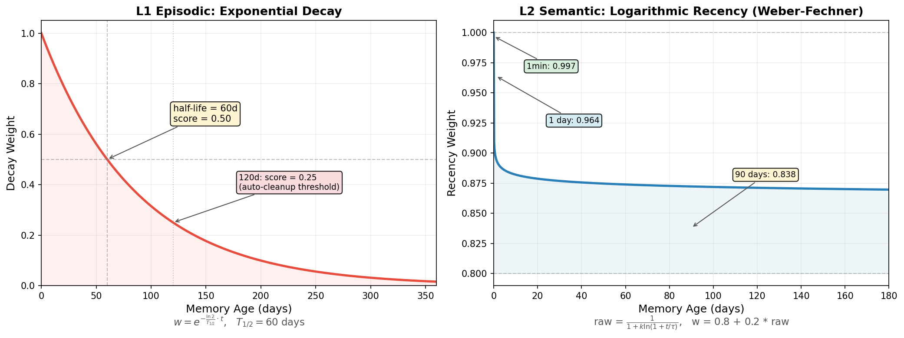

# ClickMem

**Unified memory center for AI coding agents — local-first, LAN-shareable.**

AI coding assistants (Claude Code, Cursor, OpenClaw, etc.) forget everything between sessions. Context compaction discards the preferences you stated, the decisions you made, the names you mentioned. ClickMem gives your agents persistent, searchable memory that runs on your machine and can be shared across all your tools via a single server on the local network.

## Architecture

```
┌──────────┐  ┌──────────┐  ┌──────────┐  ┌──────────────────┐
│ Claude   │  │ Cursor   │  │ OpenClaw │  │ CLI (any machine)│
│ Code     │  │          │  │          │  │                  │
└────┬─────┘  └────┬─────┘  └────┬─────┘  └────────┬─────────┘
     │MCP          │MCP          │MCP/HTTP          │HTTP
     │             │             │                  │
┌────▼─────────────▼─────────────▼──────────────────▼──────────┐
│                   ClickMem Server                             │
│  ┌─────────────┐  ┌─────────────┐  ┌──────────────────────┐ │
│  │ MCP Server  │  │ REST API    │  │  mDNS Discovery      │ │
│  │ stdio / SSE │  │ HTTP/JSON   │  │  _clickmem._tcp      │ │
│  └──────┬──────┘  └──────┬──────┘  └──────────────────────┘ │
│         └────────┬───────┘                                    │
│          ┌───────▼───────────────────────────────────────┐   │
│          │  memory_core — chDB + Qwen3 embeddings        │   │
│          │  hybrid search · LLM upsert · auto-maintain   │   │
│          └───────────────────────────────────────────────┘   │
└──────────────────────────────────────────────────────────────┘
```

**One server, all your tools.** Start `memory serve` on any machine and every Claude Code session, Cursor workspace, and OpenClaw agent on the LAN shares the same memory — preferences learned once are recalled everywhere.

## How It Works

ClickMem stores memories in [chDB](https://github.com/chdb-io/chdb) (embedded ClickHouse — a full analytical database running in-process) and generates vector embeddings locally with [Qwen3-Embedding-0.6B](https://huggingface.co/Qwen/Qwen3-Embedding-0.6B). When your agent starts a conversation, ClickMem automatically recalls relevant memories. When a conversation ends, it captures important information for later.

### Three-Layer Memory Model

```
┌─────────────────────────────────────────────────────────────────┐
│  L0  Working Memory  (scratchpad)                               │
│  "User is building Phase 2, last discussed HNSW index config"   │
│  Always injected · Overwritten each conversation · ≤500 tokens  │
├─────────────────────────────────────────────────────────────────┤
│  L1  Episodic Memory  (event timeline)                          │
│  "03-04: Decided on Python core + JS plugin architecture"       │
│  Recalled on demand · Time-decayed · Auto-compressed monthly    │
├─────────────────────────────────────────────────────────────────┤
│  L2  Semantic Memory  (long-term knowledge)                     │
│  "[preference] Prefers SwiftUI over UIKit"                      │
│  "[person] Alice is the backend lead"                           │
│  Always injected · Permanent · Updated only on contradiction    │
└─────────────────────────────────────────────────────────────────┘
```

- **L0 Working** — What the agent is doing right now. Overwritten every session.
- **L1 Episodic** — What happened and when. Decays over 120 days, old entries compressed into monthly summaries, recurring patterns promoted to L2.
- **L2 Semantic** — Durable facts, preferences, and people. Never auto-deleted. Smart upsert detects duplicates and merges via LLM.

### Search & Retrieval

Memories are found via **hybrid search** combining:
1. **Vector similarity** — 256-dim cosine distance on Qwen3 embeddings
2. **Keyword matching** — word-level hit rate on content, tags, and entities
3. **Time decay** — different strategies per layer (see below)
4. **Popularity boost** — frequently recalled memories score higher
5. **MMR diversity** — re-ranks to avoid returning redundant results

### Time Decay Weights

Different memory layers use fundamentally different decay strategies, reflecting their different roles:



**L1 Episodic — Exponential Decay** (left): Events fade quickly over time, like human episodic memory. The half-life is 60 days — a 2-month-old event scores only 50% of a fresh one. At 120 days with zero access, entries are auto-cleaned. Formula: `w = e^(-ln2/T * t)`.

**L2 Semantic — Logarithmic Recency** (right): Long-term knowledge should almost never lose relevance just because it's old. The recency weight uses the Weber-Fechner law — human perception of time differences is logarithmic: the gap between "1 minute ago" and "1 hour ago" feels significant, but "3 months ago" vs "6 months ago" feels nearly identical. The score maps to `[0.8, 1.0]`, acting as a mild tiebreaker rather than a dominant factor. Formula: `w = 0.8 + 0.2 / (1 + k * ln(1 + t/τ))`.

Concrete weight values at different ages:

| Age | L1 Episodic | L2 Semantic |
|-----|-------------|-------------|
| 1 min | 1.000 | 0.981 |
| 1 hour | 0.999 | 0.924 |
| 1 day | 0.989 | 0.896 |
| 7 days | 0.922 | 0.884 |
| 30 days | 0.707 | 0.877 |
| 60 days | 0.500 | 0.874 |
| 90 days | 0.354 | 0.872 |
| 120 days | 0.250 | 0.871 |
| 180 days | 0.125 | 0.870 |
| 1 year | 0.015 | 0.867 |

L1 episodic weight drops by half every 60 days and is nearly zero after a year — old events naturally fade out. L2 semantic weight stays in a narrow band (0.87–0.98) regardless of age, so a fact stored a year ago still scores 87% of a freshly stored one. The only way semantic memories lose relevance is through contradiction-based updates, not time.

### Self-Maintenance

ClickMem maintains itself automatically:
- Stale episodic entries (120+ days, never accessed) are cleaned up
- Old episodic entries are compressed into monthly summaries
- Recurring patterns are promoted from episodic to semantic
- Soft-deleted entries are purged after 7 days
- Semantic memories are periodically reviewed for staleness

## Install

```bash
git clone https://github.com/auxten/clickmem && cd clickmem && ./setup.sh
```

> Set `CLICKMEM_DIR` to customize the install path (default: `~/clickmem`).

For server/MCP features, install the server extras:

```bash
pip install -e ".[server]"    # REST API + MCP + mDNS
pip install -e ".[all]"       # server + LLM support
```

**What `setup.sh` does:**
1. Checks Python >= 3.10 and `uv`
2. Creates venv and installs all dependencies
3. Downloads the Qwen3-Embedding-0.6B model (~350 MB, first run only)
4. Runs tests to verify the environment
5. Imports existing OpenClaw history (if `~/.openclaw/` exists)
6. Installs the OpenClaw plugin hook

**Resource usage:** ~500 MB RAM for the embedding model, ~200 MB disk for chDB data (grows with memory count).

## Usage

### CLI — Basic Memory Operations

```bash
# Store a memory
memory remember "User prefers dark mode" --layer semantic --category preference

# Semantic search
memory recall "UI preferences"

# Delete a memory (by ID, prefix, or content description)
memory forget "dark mode preference"

# Browse memories
memory review --layer semantic

# Show statistics
memory status

# Run maintenance (cleanup, compression, promotion)
memory maintain

# Import OpenClaw history
memory import-openclaw

# Export context to workspace .md files
memory export-context /path/to/workspace
```

All commands support `--json` for machine-readable output.

### Server — LAN Memory Sharing

Start the REST API server so all tools on your network share the same memory:

```bash
# Generate an API key
memory serve --gen-key
# → Generated API key: a1b2c3d4e5f6...

# Start server (LAN-accessible)
export CLICKMEM_API_KEY=a1b2c3d4e5f6...
memory serve --host 0.0.0.0 --port 9527

# Enable SQL endpoint for debugging
memory serve --host 0.0.0.0 --debug
```

**REST API endpoints:**

| Method | Path | Description |
|--------|------|-------------|
| `GET` | `/v1/health` | Health check (no auth) |
| `POST` | `/v1/recall` | Search memories |
| `POST` | `/v1/remember` | Store a memory |
| `POST` | `/v1/extract` | LLM-extract memories from text |
| `DELETE` | `/v1/forget/{id}` | Delete a memory |
| `GET` | `/v1/review` | List memories by layer |
| `GET` | `/v1/status` | Layer statistics |
| `POST` | `/v1/maintain` | Run maintenance |
| `POST` | `/v1/sql` | Raw SQL (debug mode only) |

### Remote CLI

Use any `memory` command against a remote server:

```bash
# Via flags
memory recall "project architecture" --remote http://192.168.1.100:9527 --api-key xxx

# Via environment variables
export CLICKMEM_REMOTE=http://192.168.1.100:9527
export CLICKMEM_API_KEY=xxx
memory recall "project architecture"

# Auto-discover server on LAN via mDNS
memory recall "project architecture" --remote auto
```

### MCP Server — Claude Code & Cursor Integration

ClickMem speaks [MCP (Model Context Protocol)](https://modelcontextprotocol.io/), so Claude Code and Cursor can use it natively as a tool provider.

**Local (stdio) — best for same-machine use:**

```bash
memory mcp --transport stdio
```

**Remote (SSE) — best for LAN sharing:**

```bash
memory mcp --transport sse --host 0.0.0.0 --port 9528
```

#### Claude Code Configuration

Add to `~/.claude.json` or project `.mcp.json`:

```json
{
  "mcpServers": {
    "clickmem": {
      "command": "clickmem-mcp",
      "args": []
    }
  }
}
```

For remote (another machine's ClickMem):

```json
{
  "mcpServers": {
    "clickmem": {
      "url": "http://192.168.1.100:9528/sse"
    }
  }
}
```

#### Cursor Configuration

Add to `.cursor/mcp.json` in your project:

```json
{
  "mcpServers": {
    "clickmem": {
      "command": "clickmem-mcp",
      "args": []
    }
  }
}
```

For remote:

```json
{
  "mcpServers": {
    "clickmem": {
      "url": "http://192.168.1.100:9528/sse"
    }
  }
}
```

**MCP Tools available to agents:**

| Tool | Description |
|------|-------------|
| `clickmem_recall` | Search memories by semantic query |
| `clickmem_remember` | Store a new memory |
| `clickmem_extract` | Extract memories from conversation text |
| `clickmem_forget` | Delete a memory |
| `clickmem_status` | Show memory statistics |
| `clickmem_working` | Get or set working memory (L0) |

### LAN Discovery

ClickMem servers advertise themselves via mDNS (`_clickmem._tcp`). Find servers on your network:

```bash
memory discover
# → ✓ 192.168.1.100:9527  v0.1.0  (rest+mcp)
# → To connect: memory recall 'query' --remote http://192.168.1.100:9527
```

## Comparison

| | MEMORY.md | Mem0 | Supermemory | **ClickMem** |
|---|---|---|---|---|
| Runs locally | ✅ file | ❌ cloud API | ❌ cloud API | **✅ fully local** |
| Privacy | ✅ | ❌ data sent to API | ❌ data sent to API | **✅ zero data leaves machine** |
| Embeddings | N/A | Remote (costs $) | Remote (costs $) | **Local Qwen3 (free)** |
| Memory layers | Flat file | Semantic + Episodic | Hierarchical | **3-layer (L0/L1/L2)** |
| Search | Keyword grep | Vector + Graph | Hybrid + Relations | **Vector + Keyword + MMR** |
| Time decay | None | None | Smart forgetting | **Per-layer decay (exp + log)** |
| Deduplication | Manual | LLM 4-op upsert | Relational versioning | **LLM 4-op upsert** |
| Self-maintenance | Manual | ❌ | ❌ | **Auto (cleanup/compress/promote)** |
| Multi-tool sharing | ❌ | Cloud only | Cloud only | **✅ LAN server + MCP** |
| Access tracking | ❌ | ❌ | ✅ | **✅ popularity-weighted recall** |
| Result diversity | ❌ | ❌ | ❌ | **✅ MMR re-ranking** |
| MCP support | ❌ | ❌ | ✅ (cloud) | **✅ stdio + SSE** |
| Cost | Free | Pay per API call | Pay per API call | **Free** |

## Development

```bash
make test          # Full test suite
make test-fast     # Skip semantic tests (no model download)
make deploy-test   # rsync to remote + test
make deploy        # rsync to remote + full setup
```

## Requirements

- Python >= 3.10
- [uv](https://docs.astral.sh/uv/) package manager
- ~1 GB disk for model + data
- macOS or Linux (chDB requirement)
- Server extras: `pip install -e ".[server]"` for FastAPI, MCP, mDNS
